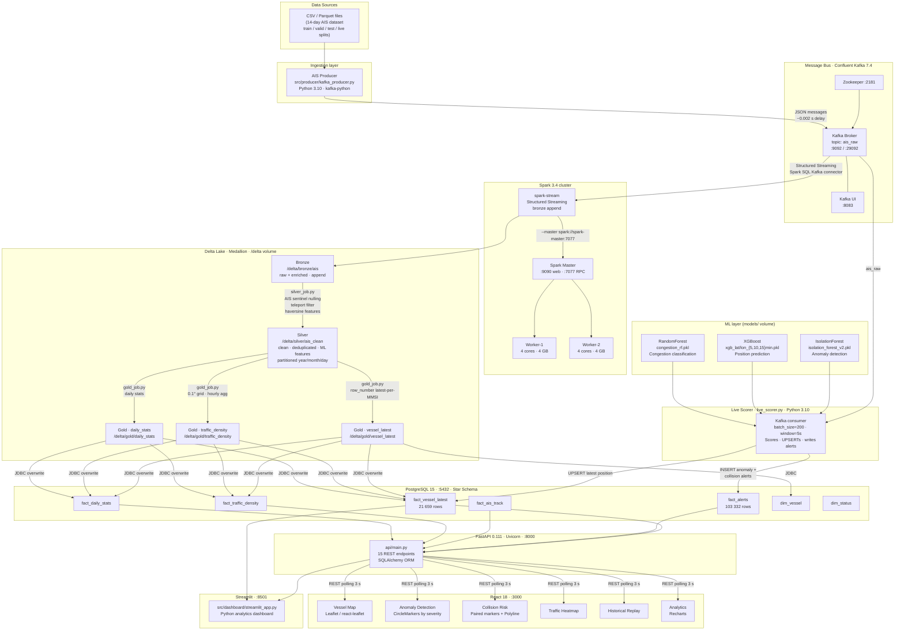
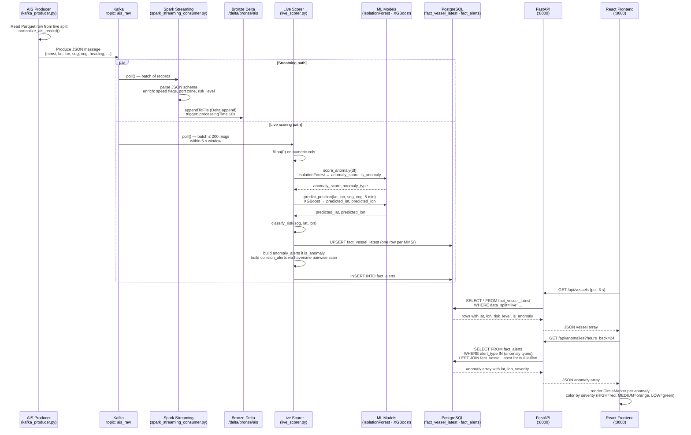
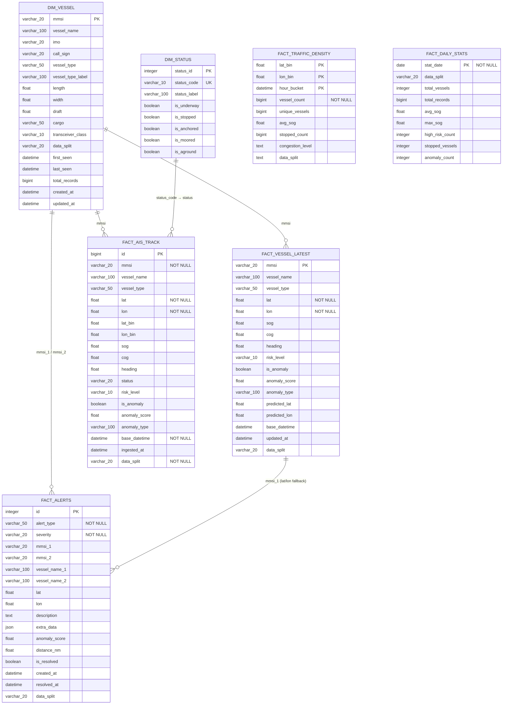

# Maritime Navigation AI System — Architecture

> All details verified against the live repo: `docker-compose.yml`, `api/models/database.py`,
> `src/common/config.py`, all processing jobs, and live PostgreSQL row counts (queried
> 2026-06-08).

---

## 1. System Architecture

---

## 2. End-to-End Data Flow — One AIS Message

---

## 3. PostgreSQL Star Schema — ER Diagram

> Columns taken verbatim from `api/models/database.py`. Logical mmsi references
> are shown as relationships; no FK constraints are declared in the ORM.

---

## 4. Component Table

| Service | Container | Purpose | Host port(s) | Technology | Why chosen |
|---|---|---|---|---|---|
| **Zookeeper** | `zookeeper` | Kafka broker coordination | — (internal :2181) | Confluent cp-zookeeper 7.4.0 | Required by Confluent Kafka 7.4; manages broker metadata and leader election |
| **Kafka** | `kafka` | Message bus for AIS stream | :9092 (internal), :29092 (host) | Confluent cp-kafka 7.4.0, topic `ais_raw` | Decouples producer from all consumers; durable log allows replay; exactly-once semantics for the streaming path |
| **Kafka UI** | `kafka-ui` | Topic browser and consumer lag monitor | :8083 | provectuslabs/kafka-ui | Zero-config GUI; observe `ais_raw` throughput without CLI |
| **Spark Master** | `spark-master` | Cluster scheduler | :9090 (Web UI), :7077 (RPC) | Apache Spark 3.4 + Delta Core 2.4.0 | Native Delta Lake integration; distributed compute for the 36 M-row AIS dataset |
| **Spark Worker 1** | `spark-worker-1` | Executor node | :9091 (Web UI) | Spark Worker, 4 cores / 4 GB | Parallel processing with Worker 2; sized for i7-14700 / 32 GB host |
| **Spark Worker 2** | `spark-worker-2` | Executor node | :9093 (Web UI) | Spark Worker, 4 cores / 4 GB | See above |
| **Spark Stream** | `spark-stream` | Kafka → Bronze live ingest | — | Spark Structured Streaming, `spark-sql-kafka-0-10_2.12:3.4.4` | Micro-batch streaming with Delta append; checkpoint at `/delta/checkpoints/bronze` ensures exactly-once Bronze writes |
| **AIS Producer** | `ais-producer` | Replays live-split Parquet to Kafka | — | Python 3.10, kafka-python 2.0.2 | Simulates live AIS feed at 0.002 s/message; loops continuously |
| **Live Scorer** | `live-scorer` | Real-time ML scoring + alert writing | — | Python 3.10, scikit-learn 1.5.1, XGBoost 2.0.3; batch_size=200, window=5 s | Separate process from the API so scoring never blocks HTTP; writes `fact_vessel_latest` (UPSERT) and `fact_alerts` (INSERT) directly to PostgreSQL |
| **FastAPI** | `maritime-api` | REST API for all dashboard features | :8000 | FastAPI 0.111.0, Uvicorn 0.30.1, SQLAlchemy 2.0.31, Python 3.11 | Async framework with auto-generated OpenAPI docs; SQLAlchemy ORM maps directly to the star schema; 15 endpoints covering all 10 dashboard features |
| **PostgreSQL** | `postgres` | Operational data store (star schema) | :5432 | PostgreSQL 15-alpine, shared_buffers=512 MB, effective_cache=2 GB | ACID guarantees for alert state; row-level locking for concurrent UPSERT from live_scorer; fast indexed reads for the React 3-second poll cycle |
| **Streamlit** | `streamlit-dashboard` | Python analytics dashboard | :8501 | Streamlit, pandas, Delta Lake reader | Rapid Python-native prototyping of ML monitoring views without a separate frontend build step |
| **React Frontend** | `maritime-frontend` | Primary user-facing dashboard | :3000 | React 18, react-leaflet 4.x, Recharts, Node 18-slim | Leaflet renders 20 000+ vessel markers efficiently with CircleMarker pooling; Recharts covers time-series analytics; hot-reload dev server via `npm start` |

---

## 5. Medallion Layer Table

| Layer | Delta path | PostgreSQL table(s) | Live row count | Transformations applied |
|---|---|---|---|---|
| **Raw** | `/app/data/parquet` | — | ~36 M rows across 14 days | Parquet files converted from CSV; columnar storage for efficient Spark reads; `data_split` column partitions into train / valid / test / live |
| **Bronze** | `/delta/bronze/ais` | — | Streaming append (grows continuously) | Quality filters: non-null mmsi/lat/lon, valid ranges (lat ∈ [−90,90], lon ∈ [−180,180], sog ∈ [0,60]); enrichment: `event_time`, `ingestion_time`, `is_stopped`, `is_slow`, `is_speeding`, `in_us_port_zone`, rule-based `risk_level`; written by both `spark_streaming_consumer.py` (live) and `bronze_job.py` (batch) |
| **Silver** | `/delta/silver/ais_clean` | — | Up to 5 000 000 rows (batch cap) | AIS sentinel nulling (sog = 102.3 → null, heading = 511 → null); kinematic bounds filter; teleport/GPS-glitch filter (implied speed > 100 kn dropped); deduplication on (mmsi, base_datetime); vessel info forward-fill per MMSI; human-readable `vessel_type_label` and `status_label`; ML features: `sog_change`, `heading_change`, `distance_nm` (haversine, R = 3 440.065 nm), `time_delta_sec`, `lat_bin_fine` (2 dp), `lon_bin_fine` (2 dp); first pings dropped; partitioned by year / month / day |
| **Gold — vessel_latest** | `/delta/gold/vessel_latest` | `fact_vessel_latest` (21 659 rows) | One row per MMSI | `row_number()` window over mmsi ordered by `base_datetime DESC`; keeps only latest ping; JDBC overwrite to PostgreSQL |
| **Gold — traffic_density** | `/delta/gold/traffic_density` | `fact_traffic_density` (0 rows — batch not yet run) | Aggregated grid cells | Group by (`lat_bin`, `lon_bin`, `hour_bucket`, `data_split`); agg: `vessel_count`, `unique_vessels`, `avg_sog`, `stopped_count`; `congestion_level` = HIGH if count ≥ 15, MEDIUM if ≥ 5, else LOW |
| **Gold — daily_stats** | `/delta/gold/daily_stats` | `fact_daily_stats` (0 rows — batch not yet run) | One row per day | Group by (`stat_date`, `data_split`); agg: `total_vessels`, `total_records`, `avg_sog`, `max_sog`, `high_risk_count`, `stopped_vessels`; `anomaly_count` placeholder (lit 0) |
| **Gold — anomalies** | `/delta/gold/anomalies` | — | Written by gold_job | Reserved path for batch anomaly aggregations (`DELTA_GOLD_ANOMALY_PATH`) |
| **Serving (live)** | — | `fact_alerts` (103 332 rows) | Continuously growing | Written exclusively by `live_scorer.py`: IsolationForest anomaly alerts + haversine pairwise collision detection; `fact_vessel_latest` enriched with `anomaly_score`, `is_anomaly`, `predicted_lat/lon` from XGBoost |

---

## ML Models

| Model | File | Algorithm | Training data | Features | Purpose |
|---|---|---|---|---|---|
| Anomaly detector | `isolation_forest_v2.pkl` + `scaler_anomaly_v2.pkl` | Isolation Forest (sklearn, n_estimators=200, contamination=0.002) | Silver TRAIN split | `sog`, `cog`, `heading`, `sog_change`, `heading_change`, `distance_nm` | Flags vessels with unusual kinematics; score ≥ 0.7 → HIGH, ≥ 0.5 → MEDIUM |
| Position predictor | `xgb_lat_{5,10,15}min.pkl` + `xgb_lon_{5,10,15}min.pkl` | XGBoost regressor (one model per horizon per axis) | Silver TRAIN split | Kinematic + position features | Predicts vessel position 5 / 10 / 15 minutes ahead for CPA calculation |
| Congestion classifier | `congestion_rf.pkl` + `congestion_encoder.pkl` | Random Forest (sklearn) | Gold traffic_density aggregations | Density grid features | Classifies grid cells as LOW / MEDIUM / HIGH congestion |

---

## Geographic Scope

The system is scoped to **US waters** (lat 24–49°N, lon 125–66°W) with five named high-priority port zones:

| Zone | Lat range | Lon range |
|---|---|---|
| Houston Ship Channel | 29.50–29.85°N | 95.30–94.80°W |
| New York Harbor | 40.50–40.75°N | 74.30–73.90°W |
| Port of Los Angeles / Long Beach | 33.70–33.85°N | 118.35–118.10°W |
| Port of New Orleans | 29.00–30.00°N | 90.50–89.50°W |
| Port of Miami | 25.70–25.85°N | 80.20–80.05°W |

Dashboard maps default to `[38.5, −75.5]` zoom 6 (US East Coast).
